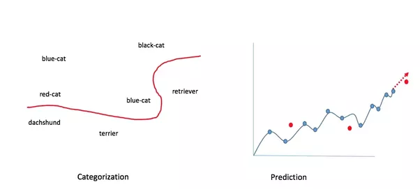

# MachineLearningUsingPython
  
Machine Learning is a latest __buzzword__ floating around. It desrves to, as it is one of the most interesting subfield of Computer Science. 
What does Machine Learning really means? 
It provides computers with __aility to learn__ without being eplicitly prgrammed.  

Let's try and understand in layman terms:
- Two task we do all the time, both consciously and subconsciously, is
  - To __categorize__ what we perceive through our senses (e.g. hot or cold paper cup, hot or cold ceramic mug)
  - To __predict__ the future based on our past experience and,
  - Perform new actions where predictions and categorization often occur in tandem
    - For e.g., we continue to increase the pressure holding a paper cup until we feel its just right and stop well before we crush it. If it was a cermaic cup it would be a quick grip no concern of crushing. 
    - The action is driven by some for of reward(e.g. the taste of a drink).
  

We do both these tasks - __categorization__ and __prediction__. 
If we were to visualize categorization and predictions, they look like __two sides of the same coin__:
- In the case of categorization a __line is drawn separating__ the data points -  cats and dogs.
- In the case of prediction a line is drawn throught he given data points and often __used to estimate__ if it would continue to grow/fall.
  

## Repository Overview
This repository is about different Machine Learning algorithm approaches as per the industry practices.

## Table of Contents
- [Telecom Churn Prediction](#section1) 
- [Credit Card Defaulters](#section2) 
- [Spam Detection](#section3) 

## Projects in execution

