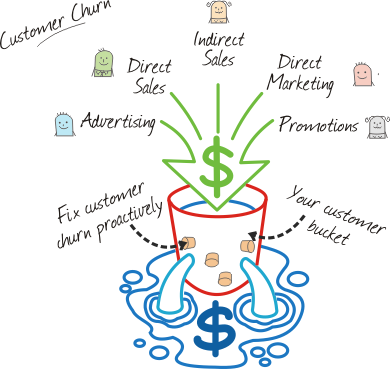

# Customer Attrition

Customer attrition, also known as customer churn, customer turnover, or customer defection, is the loss of clients or customers.

Telephone service companies, Internet service providers, pay TV companies, insurance firms, and alarm monitoring services, often use customer attrition analysis and customer attrition rates as one of their key business metrics  because the cost of retaining an existing customer is far less than acquiring a new one. Companies from these sectors often have customer service branches which attempt to win back defecting clients, because recovered long-term customers can be worth much more to a company than newly recruited clients.

Companies usually make a distinction between voluntary churn and involuntary churn. Voluntary churn occurs due to a decision by the customer to switch to another company or service provider, involuntary churn occurs due to circumstances such as a customer's relocation to a long-term care facility, death, or the relocation to a distant location. In most applications, involuntary reasons for churn are excluded from the analytical models. Analysts tend to concentrate on voluntary churn, because it typically occurs due to factors of the company-customer relationship which companies control, such as how billing interactions are handled or how after-sales help is provided.

predictive analytics  use churn prediction models that predict customer churn by assessing their propensity of risk to churn. Since these models generate a small prioritized list of potential defectors, they are effective at focusing customer retention marketing programs on the subset of the customer base who are most vulnerable to churn.
# Use Case: Telecom Churn

"Predict behaviour to retain customers. You can analyze all relevant customer's data and develop focused customer retention
# Data overview

Here in the dataset, each row represents a customer, each column contains customer's attributes described in column Metadata.

**The Data set includes information about:**
- Customers who left within the last month - the column is called Churn.
- Services that each customer has signed up for - phone, multiple lines, internet, online security, online bacup, device protection, tech support and streaming TV and movies.
- Customer account information - How long they've been a customer, contract, payment method, paperless billing, monthly charges and total charges.
- Demographic info about Customers- gender, age, range, and if they have partners and dependents.
# Insights
